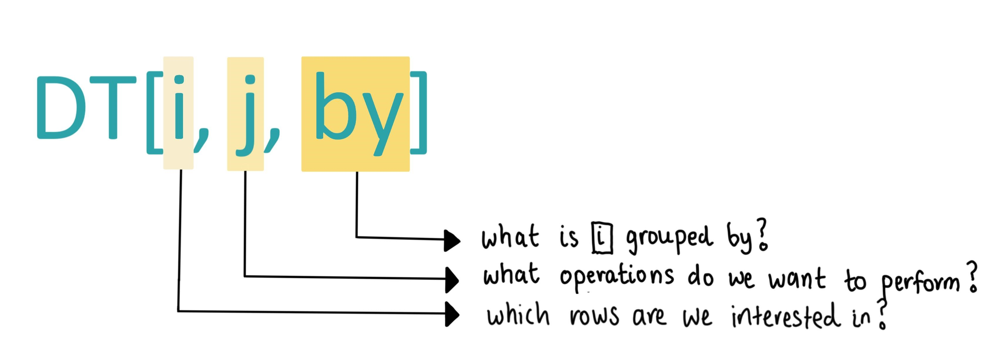

```{r setup, include=FALSE}
knitr::opts_chunk$set(echo = TRUE, results = 'hide') 
knitr::knit_engines$set(python = reticulate::eng_python)  
options(scipen=999)
```


# Introduction   

An inevitability of programming is that languages come and go. I am reminded of this when colleagues tell me about the first languages that they learnt or used in their academic research.  

It's taken me a while to realise that programming languages are still human constructs - they hold sway when they are utilised en mass (i.e. Python for machine learning) and user factions may emerge if two very different ways of doing the same thing concurrently exist.      

In R, the latter can manifest in the form of `data.table` versus `dplyr` debates. ^[I am extremely thankful for these Twitter debates, as they first drew my attention to `data.table`.]    

```{r, echo = FALSE, results = 'markup', fig.align = 'center', out.width = '60%'} 

```

Both R packages contain a comprehensive stack of functions for data wrangling. The tidyverse `dplyr` approach emphasises code readability whilst `data.table` scales complex manipulations of large datasets very efficiently. You can compare the efficiency of `data.table` versus other data wrangling packages on large datasets [here](https://h2oai.github.io/db-benchmark/).    

Whilst I prefer to use `dplyr` on small datasets where `data.table` efficiency gains are negligible, I recommend using `data.table` when:      

+ You are using very large datasets (datasets over 1 million rows) **and**   
+ You need to use **group by** operations for data cleaning or feature engineering.         

Let's explore this for ourselves.            

```{r, message = FALSE, warning = FALSE}
#-----load required packages-----  
if (!require("pacman")) install.packages("pacman")
pacman::p_load(here,
               ids, # generate random ids
               tidyverse,
               data.table,
               lobstr, # trace objects in memory  
               DT, # create interactive tables  
               microbenchmark,
               reticulate)

#-----set up the Python reticulate engine-----  
conda_list() # list available conda environments
use_condaenv("r-reticulate")
```

```{r, echo = FALSE}
#-----set plugin to knit Python code chunks-----
py_run_string("import os as os")
py_run_string("os.environ['QT_QPA_PLATFORM_PLUGIN_PATH'] = 'C:/Users/user/Anaconda3/envs/r-reticulate/Library/plugins/platforms'")    
```


# Create a test dataset  

Imagine you have a dataset describing how students are engaging with online courses:     

+ Each student has a unique ID.  
+ There are 5 different online platforms (labelled platforms A, B, C, D and E).  
+ Students have the option of taking different courses within the same platform or switching to a different platform.   
+ Start dates are recorded when the student starts the first course in a new platform.    
+ End dates are also recorded when the student exits a platform.       

**Note:** The code used to create this dataset can be accessed from my github repository [here](https://github.com/erikaduan/R-tips/blob/master/03_blog_posts/2020-04-07_data-table-versus-dplyr/2020-04-07_data-table-versus-dplyr.md).    

```{r, echo = FALSE}
#-----create a function to generate random dates-----  
create_start_dates <- function(start_date, end_date, n) {
  if(!is.character(start_date) | !is.character(end_date)) {
    stop("Error: start_date and end_date should be written in the format YYYY-mm-dd")
  }
  
  start_date <- as.Date(start_date, format = "%Y-%m-%d")
  end_date <- as.Date(end_date, format = "%Y-%m-%d")  
  
  if(end_date < start_date) {
    stop("Error: start_date should be earlier than end_date")
  }
  
  set.seed(111)
  new_date <- sample(seq(start_date, end_date, by = "day"),
                     n,
                     replace = T)
  return(new_date)
}  
```

```{r, echo = FALSE}
#-----create a test dataset of 500000 course enrollments-----
# create 80000 unique student_ids and sample with replacement 500000 times  

set.seed(111)
students <- random_id(n = 150000, bytes = 4,
                      use_openssl = F) # so set.seed() works  

student_id <- sample(students, 500000,
                     replace = T) %>%
  sort()

#-----simulate 5 platforms with different market shares----- 
online_platform <- sample(LETTERS[1:5], 500000,
                          replace = T,
                          prob = c(0.35, 0.05, 0.1, 0.3, 0.2)) 

#-----create 20 unique course_names-----
courses <- c("R_beginner",
             "R_intermediate",
             "R_advanced",
             "Python_beginner",
             "Python_intermediate",
             "Python_advanced",
             "machine_learning",
             "linear_algebra",
             "statistics",
             "UX_design",
             "website_design",
             "data_mining",
             "travel_writing",
             "bread_baking",
             "pottery",
             "poetry_writing",
             "contemporary_dance",
             "carpentry",
             "metal_welding",
             "fitness_training")  

online_course <- sample(courses, 500000,
                        replace = T)  

student_courses <- tibble(index = seq(1, 500000, 1), # create an index to join by
                          student_id,
                          online_platform,
                          online_course)

#-----create platform_start_date-----  
platform_subset <- student_courses %>%
  select(index, 
         student_id,
         online_platform) %>% 
  mutate(unique_group = str_c(student_id, online_platform, sep = "-")) %>%
  group_by(student_id) %>%
  mutate(previous_unique_group = lag(unique_group, 1)) %>%
  ungroup()

# filter to keep rows representing the first time a student commences on a new platform      

platform_subset <- platform_subset %>%
  filter(is.na(previous_unique_group) | previous_unique_group != unique_group)

platform_start_date <- create_start_dates(start_date = "2016-01-01", end_date = "2019-01-01",  
                                          n = nrow(platform_subset))

platform_subset <- platform_subset %>%
  mutate(platform_start_date = platform_start_date)

#-----create provider_end_date-----
# create random course lengths 

set.seed(111)
platform_length <- runif(nrow(platform_subset),
                         min = 9, max = 60) %>%
  floor(.)

platform_subset <- platform_subset %>%
  mutate(platform_end_date = platform_start_date + platform_length)

#-----left join online_course to provider_subset by index-----
platform_subset <- platform_subset %>%
  select(index,
         platform_start_date,
         platform_end_date)     

student_courses <- left_join(student_courses,
                             platform_subset,
                             by = "index")

student_courses <- student_courses %>%
  fill(c(platform_start_date, platform_end_date), 
       .direction = "up")  

student_courses <- student_courses %>%
  select(-index)   

#TODO create course start date and course end date 
# course start date is a random number between platform start and end date for subsequent courses on same platform
```

```{r, echo = FALSE}
#-----remove all objects except student_courses-----  
rm(list = setdiff(ls(), "student_courses"))
gc()
```

We can interactively examine the first 20 rows of the dataset using the R package `DT`.      

```{r, echo = FALSE, results = 'markup'}
#-----examine the first few rows of data-----  
student_courses %>%
  head(20) %>%
  datatable(rownames = F,
            options = list(pageLength = 6, dom = 'tip',
                           initComplete = JS(
                             "function(settings, json) {",
                             "$(this.api().table().header()).css({'background-color': '#37ACA1', 'color': '#fff'});",
                             "}")))
```


# Principles of `data.table`     

In R, datasets exist as `data.frame` type objects. To apply `data.table` functions on a dataset, we need to convert a `data.frame` into a `data.table` object using `setDT()`.      

This function is flexible as it converts a `data.frame` by reference (i.e. without creating a duplicate `data.table` copy) and assigns both `data.table` and `data.frame` classes to the converted object.    

```{r}
#-----convert data frame into data.table-----  
class(student_courses)
#> [1] "tbl_df"     "tbl"        "data.frame"

mem_used()
#> 222,639,352 B

tracemem(student_courses) # track object assignment in memory  
#> [1] "<0000022B07B7AB70>"   

setDT(student_courses) # data.table is assigned to a new location in memory   
#> tracemem[0x0000022b07b7ab70 -> 0x0000022b047a8478]: as.list.data.frame as.list vapply vapply_1i setDT   

untracemem(student_courses)   

mem_used() # note that computer memory has not doubled following setDT()    
#> 242,674,176 B  

class(student_courses)
#> [1] "data.table" "data.frame"    
```


## `data.table` query structure

A `data.table` query is structured in the form `DT[i, j, by]` where:  

+ Data selection (i.e. filtering or sorting rows) is performed in the `i` placeholder.    
+ Data column selection or creation is performed in the `j` placeholder.       
+ Grouping data by variable(s) is performed in the `by` placeholder.        

```{r, echo = FALSE, results = 'markup', fig.align = 'center', out.width = '80%'} 

```


## `data.table` efficiency gains    

There are a few reasons why `data.table` operations are fast:  

+ Many of its operations, including grouping, reading and writing, are parallelised by default.   
+ `data.table` automatically creates a secondary index (or key) of the columns used to subset data, so that subsequent operations on the same column are much faster.  
+ `data.table` has a much faster `order()` function, which is also utilised for the evaluation of groupings.  
+ You can use the operator `:=` to add, delete or modify columns in place, which is a faster alternative to R's default copy-on-modify behaviour.     

```{r}
#-----create data.frame and data.table objects----- 
df <- data.frame(id = seq(1:5),
                 letter = letters[1:5])

dt <- as.data.table(df)  

#-----update a data.frame column using copy-on-modify----- 
df_2 <- df %>%
  mutate(letter = toupper(letter)) 

# the new data frame is a shallow copy of the original data frame 
# only modified columns are newly created in memory     

ref(df, df_2)
#> o [1:0x22b03b6c998] <df[,2]> 
#> +-id = [2:0x22b7f3f6350] <int> 
#> \-letter = [3:0x22b0c54b328] <chr> 
 
#> o [4:0x22b03b90e78] <df[,2]> 
#> +-id = [2:0x22b7f3f6350] 
#> \-letter = [5:0x22b05f9b890] <chr> 

#-----update a data.table column by reference-----
obj_addr(dt)
#> [1] "0x22b016ed030"

dt[, letter := toupper(letter)]

obj_addr(dt)
#> [1] "0x22b016ed030"  
```

```{r, results = 'markup'}
dt # check that dt has been modified in place    
```

**Note:** You do not need to assign datasets to names when modifying by reference using the `:=` operator.         


# Filter data     


## Using `dplyr` versus `data.table`     

The syntax for filtering data is very similar for `dplyr` and `data.table`. 

```{r}
#-----filter student_courses using dplyr-----    
student_courses %>%
  filter(online_platform == "A") 

student_courses %>%
  filter(online_platform != "A") 

student_courses %>%
  filter(online_platform %in% c("A", "C")) 

student_courses %>%
  filter(student_id == "00007f23", # a comma represents the condition and/&
        between(platform_start_date, "2017-01-01", "2017-12-31"))

student_courses %>%
  filter(str_detect(online_course, "^R_")) 
```

A difference is that `data.table` also contains a list of helper functions with optimised performance for filtering on specific data types like characters or integers.       

```{r}
#-----filter student_courses using data.table-----  
student_courses[online_platform == "A"] 

student_courses[online_platform != "A"] 

student_courses[online_platform %chin% c("A", "C")] 

student_courses[student_id == "00007f23" & platform_start_date %between% c("2017-01-01", "2017-12-31")]  

student_courses[online_course %like% "R_"]

# %chin% is equivalent to but much faster than %in%  
# %like% allows you to search for a pattern in a character vector 
# %between% allows you to search for values in a closed interval  
```


## Using `Pandas`    

And because R versus Python language wars are unnecessary, let's filter the same dataset using the Python `Pandas` package and benchmark the results. 

**Note:** Objects generated in R only exist within the R environment. To share data between R <> Python environments, we need to convert R `data.frames` into Pandas `DataFrames` by calling them into the Python environment.    

```{python, message = FALSE}
#-----convert R data.frame object into the Python environment-----  
import pandas as pd  

pd_courses = r.student_courses # call R data.frame into Python environment  

# convert pd_courses date columns using pd.to_datetime  

pd_courses["platform_start_date"] = pd.to_datetime(pd_courses["platform_start_date"])  
pd_courses["platform_end_date"] = pd.to_datetime(pd_courses["platform_end_date"]) 
```

```{python}
#-----filter pd_courses using Pandas----- 
pd_courses[pd_courses["online_platform"] == "A"]  
pd_courses[pd_courses["online_platform"] != "A"]   
pd_courses[pd_courses["online_platform"].isin(["A", "C"])]   
pd_courses[pd_courses["online_course"].str.startswith("R_")]    
# str.startswith() does not accept regex input i.e. "^R_" does not work 
```

```{python}
#-----create separate conditions to filter complex multiple conditions-----  
student = pd_courses["student_id"] == "00007f23" 
date_start = pd_courses["platform_start_date"] >= "2017-01-01"
date_end = pd_courses["platform_start_date"] <= "2017-12-31"

pd_courses[student & date_start & date_end] 
```


## Benchmark data filtering   

You can use the R package `microbenchmark` and Python package `timeit` to measure code performance. ^[For accurate benchmarking in R, you need to separately run, save and print `microbenchmark()` outputs rather than directly knitting results.]       

The R function `microbenchmark()` runs each expression 100 times by default with the argument `times = 100L`. It outputs summary statistics for how long it takes to evaluate a single expression.  

The Python  function `timeit()` runs each expression 1,000,000 times by default and outputs in seconds the time taken to evaluate everything. We will change the latter number to 100 times with the argument `number = 100` to match our R `microbenchmark()` input.         

```{r, echo = FALSE, results = 'markup'}
#-----benchmark dplyr and data.table functions-----  
if (!file.exists(here("data", "data-table-benchmarks", "fmb.rds"))) {
  
  fmb <- microbenchmark(filter(student_courses, online_platform == "A"),
                        student_courses[online_platform == "A"],
                        filter(student_courses, online_platform %in% c("A", "C")),
                        student_courses[online_platform %chin% c("A", "C")],
                        filter(student_courses, str_detect(online_course, "^R_")),
                        student_courses[online_course %like% "R_"]) 
  
  saveRDS(fmb, here("data", "data-table-benchmarks", "fmb.rds"))
}

fmb <- readRDS(here("data", "data-table-benchmarks", "fmb.rds"))
knitr::kable(summary(fmb), caption = "Units: milliseconds")    
```

```{python, echo = FALSE}
#-----print timeit outputs-----   
import timeit

filter_a = '''
def filter_a():
  pd_courses[pd_courses["online_platform"] == "A"]
'''

filter_ac = '''
def filter_ac():
  pd_courses[pd_courses["online_platform"].isin(["A", "C"])]
'''

filter_str_r = '''
def filter_str_r():
  pd_courses[pd_courses["online_course"].str.startswith("R_")] 
'''

# total timeit output needs to be converted from seconds into milliseconds      
# total timeit output needs to be divided by the number of iterations 

output_a = 10 * timeit.timeit(filter_a, number = 100)
output_ac = 10 * timeit.timeit(filter_ac, number = 100)
output_r = 10 * timeit.timeit(filter_str_r, number = 100)
```

```{r, echo = FALSE, results = 'markup'}
pandas_mb <- data.frame("expr" = c('pd_courses[pd_courses["online_platform"] == "A"]',
                                   'pd_courses[pd_courses["online_platform"].isin(["A", "C"])]',
                                   'pd_courses[pd_courses["online_course"].str.startswith("R_")]'),
                        "mean" = c(py$output_a, 
                                   py$output_ac,
                                   py$output_r),
                        "neval" = rep(100, 3))  

knitr::kable(pandas_mb, caption = "Units: milliseconds")     
```


# Sort data    


## Using `dplyr` versus `data.table`    

Sorting a dataframe can be computationally expensive when you need to order your dataset by multiple variables. This is why I only sort my dataframe once, at the start of the data cleaning workflow after basic data cleaning operations have been performed.         

```{r}
#-----sort data using dplyr-----    
student_courses %>%
  arrange(student_id) 

student_courses %>%
  arrange(student_id,
          online_platform,
          desc(platform_start_date)) 

# a descending start date shows the most recent dates first  
```

In `data.table`, data sorting is also performed inside `i` of `DT[i, j, by]`. Using the operator `-` in front of a variable allows sorting by descending order.     

```{r}
#-----sort student_courses using data.table----- 
student_courses[order(student_id)]  

student_courses[order(student_id,
                      online_platform,
                      -platform_start_date)]  

# you can also order columns in place using setorder()  

setorder(student_courses,
         student_id, online_platform, -platform_start_date)  
```


## Using `Pandas`   

```{python}
#-----sort student_courses using Pandas----- 
pd_courses.sort_values("student_id")
pd_courses.sort_values(["student_id", "online_platform", "platform_start_date"],
                       ascending = [True, True, False])  
                       
# for ascending, True sorts in ascending order and False sorts in descending order 
```


## Benchmark data sorting   

We can see that the `order()` method from `data.table` sorts data much faster than its equivalent `dplyr` function.        

```{r, echo = FALSE, results = 'markup'}
#-----benchmark dplyr and data.table functions-----  
if (!file.exists(here("data", "data-table-benchmarks", "smb.rds"))) {
  
  smb <- microbenchmark(arrange(student_courses, student_id),
                        student_courses[order(student_id)],
                        arrange(student_courses, student_id, online_platform, desc(platform_start_date)),  
                        student_courses[order(student_id, online_platform, -platform_start_date)],
                        times = 10)
  
  saveRDS(smb, here("data", "data-table-benchmarks", "smb.rds"))
}

smb <- readRDS(here("data", "data-table-benchmarks", "smb.rds"))
knitr::kable(summary(smb), caption = "Units: milliseconds")
```

```{python, echo = FALSE}
#-----print timeit outputs-----   
sort_1_cols = '''
def sort_1_cols():
  pd_courses.sort_values("student_id")
'''

sort_3_cols = '''
def sort_3_cols():
  pd_courses.sort_values(["student_id", "online_platform", "platform_start_date"],
                         ascending = [True, True, False])
'''

output_sort_1_cols = 10 * timeit.timeit(sort_1_cols, number = 100)
output_sort_3_cols = 10 * timeit.timeit(sort_3_cols, number = 100)
```

```{r, echo = FALSE, results = 'markup'}
pandas_mb <- data.frame("expr" = c('pd_courses.sort_values("student_id")',
                                   'pd_courses.sort_values(["student_id", "online_platform", "platform_start_date"],\nascending = [True, True, False])'),
                        "mean" = c(py$output_sort_1_cols, 
                                   py$output_sort_3_cols),
                        "neval" = rep(100, 2))  

knitr::kable(pandas_mb, caption = "Units: milliseconds")     
```


# Select data columns    


## Using `dplyr` versus `data.table`  

In `dplyr`, performing operations on a tibble will always return another data frame, unless you explicitly use `pull()` to extract a column as a vector.  

```{r}
#-----select column(s) using dplyr-----   
student_courses %>%
  select(student_id)

student_courses %>%
  select(c(student_id, online_platform, online_course))

student_courses %>%
  select(contains("date", ignore.case = F))

#-----output a data.frame with select()-----
student_courses %>%
  select(student_id) %>%
  class()
#> [1] "data.table" "data.frame"  

#-----output a vector with pull()-----
student_courses %>%
  pull(student_id) %>%
  class()
#> [1] "character"
```

In `data.table`, column selection is performed inside `j` of `DT[i, j, by]` and returns a `data.table` if you wrap column names inside a list.   

```{r}  
#-----select column(s) using data.table-----  
student_courses[,
                .(student_id)]

student_courses[,
                .(student_id,
                  online_platform,
                  online_course)]

grep("date", names(student_courses), value = T)
#> [1] "platform_start_date" "platform_end_date" 

student_courses[,
                grep("date", names(student_courses), value = T), 
                with = F]

#-----output a data frame by wrapping column names inside a list-----  
class(student_courses[, .(student_id)])
#> [1] "data.table" "data.frame"   

#-----output a vector-----
class(student_courses[, student_id])  
#> [1] "character"

class(student_courses[["student_id"]])  
#> [1] "character"
```   


## Using `Pandas`    

Selecting a single column will return a Pandas Series or DataFrame, depending on whether you wrap the column selection inside single versus double square brackets respectively.   

**Note:** The syntax for selecting columns using regex may be confusing to R users, as it is done by applying the `.filter(regex = "pattern")` method to the Pandas DataFrame.     

```{python}
#-----select column(s) using using Pandas-----   
pd_courses[["student_id"]]
pd_courses[["student_id", "online_platform", "online_course"]]
pd_courses.filter(regex = "date")
```

```{python}
#-----output a Pandas DataFrame-----
type(pd_courses[["student_id"]])
#> <class 'pandas.core.frame.DataFrame'>
```

```{python}
#-----output a Pandas Series or list-----
type(pd_courses["student_id"])
#> <class 'pandas.core.series.Series'> 

type(list(pd_courses["student_id"]))
#> <class 'list'>   
```


## Benchmark column selection     

Interestingly, benchmarking shows that `dplyr` performs slightly faster than `data.table` for column selections.  

```{r, echo = FALSE, results = 'markup'}
#-----benchmark dplyr and data.table functions-----  
if (!file.exists(here("data", "data-table-benchmarks", "slmb.rds"))) {
  
  slmb <- microbenchmark(select(student_courses, c(student_id, online_platform, online_course)),   
                         student_courses[, .(student_id, online_platform, online_course)],
                         select(student_courses, contains("date", ignore.case = F)), 
                         student_courses[, grep("date", names(student_courses), value = T), with = F],
                         times = 100)  
  saveRDS(slmb, here("data", "data-table-benchmarks", "slmb.rds")) 
} 

slmb <- readRDS(here("data", "data-table-benchmarks", "slmb.rds"))   
knitr::kable(summary(slmb), caption = "Units: milliseconds")    
```

```{python, echo = FALSE, message = FALSE, results = 'markup'}
#-----print timeit outputs-----   
select_3_cols = '''
def select_3_cols():
  pd_courses[["student_id", "online_platform", "online_course"]]  
'''

select_dates = '''
def select_dates():
  pd_courses.filter(regex = "date")   
'''

output_select_3_cols = 10 * timeit.timeit(select_3_cols, number = 100)
output_select_dates = 10 * timeit.timeit(select_dates, number = 100)
```

```{r, echo = FALSE, results = 'markup'}
pandas_mb <- data.frame("expr" = c('pd_courses[["student_id", "online_platform", "online_course"]]',
                                   'pd_courses.filter(regex = "date")'),
                        "mean" = c(py$output_select_3_cols, 
                                   py$output_select_dates),
                        "neval" = rep(100, 2))    

knitr::kable(pandas_mb, caption = "Units: milliseconds")     
```


# Column creation      


## Using `dplyr` versus `data.table`  

In `dplyr` version >= 1.0.0, we can use `mutate()` in combination with `across()` to create new columns or apply transformations across one or multiple columns. A shallow `data.frame` copy is created whenever a column is modified, which we then assign a name to.    

```{r}
#-----create column(s) using dplyr-----  
# create new columns 
student_courses <- student_courses %>%
  mutate(platform_dwell_length = platform_end_date - platform_start_date,
         platform_start_year = as.numeric(str_extract(platform_start_date, "^.{4}(?!//-)")))

#-----create a new column by evaluating multiple conditions using dplyr-----  
str_subset(unique(student_courses$online_course), "^R_")
#> [1] "R_beginner"     "R_advanced"     "R_intermediate"
str_subset(unique(student_courses$online_course), "^Python_")
#> [1] "Python_intermediate" "Python_advanced"     "Python_beginner"    

student_courses <- student_courses %>%
  mutate(studied_programming = case_when(str_detect(online_course, "^R_") ~ "Studied R",
                                         str_detect(online_course, "^Python_") ~ "Studied Python",
                                         TRUE ~ "No"))    

#-----remove newly created columns using dplyr-----  
student_courses <- student_courses %>%
  select(-c(platform_dwell_length,
            platform_start_year, 
            studied_programming))
```

Data frame outputs are slightly different in `data.table`:     

+ One or multiple transformations are modified in place using the operator `:=`, providing that newly created columns are not concurrently referenced.        
+ Use subassignment to only extract the columns transformed inside `j` of `DT[i, j, by]`.  

**Note:** You can create multiple columns that are modified in place using the `:=` operator. This can be written as either `df[, c("add_1", "add_2") := .(fun(x) x + 1, fun(x) x + 2)]` or `df[, `:=` (add_1 = fun(x) x + 1, add_2 = fun(x) x + 2)]`.       

```{r}
#-----create column(s) using data.table-----  
student_courses[,
                `:=` (platform_dwell_length = platform_end_date - platform_start_date,
                      platform_start_year = str_extract(platform_start_date, "^.{4}(?!//-)"))] 

student_courses[,
                platform_start_year := as.numeric(platform_start_year)]  

#-----create a new column by evaluating multiple conditions using data.table-----
student_courses[,
                studied_programming := fcase(
                  str_detect(online_course, "^R_"), "Studied R",
                  str_detect(online_course, "^Python_"), "Studied Python",
                  default = "No"
                )]

#-----remove newly created columns using data.table-----
student_courses[,
                c("platform_dwell_length",
                  "platform_start_year",
                  "studied_programming") := NULL]
```

```{r}
#-----only columns transformed inside j will be kept-----  
# use subassignment if you want to only subset the transformed columns     
platform_records <- student_courses[,
                                    .(id = toupper(student_id),
                                      platform = tolower(online_platform))]  

ncol(platform_records)
#> [1] 2  
```


## Using `Pandas`    

In `Pandas`, we can create new columns by directing applying operations onto columns or using `apply()` or `applymap()` with functions to transform single columns or element-wise across the entire data frame respectively.    

```{python}
#-----create column(s) using Pandas-----
# create new columns  
pd_courses["platform_dwell_length"] = (pd_courses["platform_end_date"] - pd_courses["platform_start_date"]).dt.days  
pd_courses["platform_start_year"] = pd_courses["platform_start_date"].dt.year   
```

```{python}
#-----create a new column by evaluating multiple conditions using Pandas-----   
def clean_course_lan(value):
    if value.startswith("R_"):
        return "Studied R"   
    elif value.startswith("Python_"):
        return "Studied Python"
    else:
        return "No"   
      
pd_courses["studied_programming"] = pd_courses["online_course"].apply(clean_course_lan)   

# .apply(axis = 0) is the default argument i.e. apply function to each column     
```

```{python}
#-----remove newly created columns using Pandas----- 
pd_courses.drop(columns = ["platform_dwell_length", "platform_start_year","studied_programming"],
                inplace = True)
```


## Benchmark column creation            

```{r, echo = FALSE, results = 'markup'}
#-----benchmark dplyr and data.table functions-----  
if (!file.exists(here("data", "data-table-benchmarks", "ccmb.rds"))) {
  
  ccmb <- microbenchmark(mutate(student_courses,
                                platform_dwell_length = platform_end_date - platform_start_date),
                         student_courses[, "platform_dwell_length" := platform_end_date - platform_start_date], 
                         dplyr_case_when = mutate(student_courses,
                                                  studied_programming = case_when(str_detect(online_course, "^R_") ~ "Studied R",
                                                                                  str_detect(online_course, "^Python_") ~ "Studied Python",
                                                                                  TRUE ~ "No")),    
                         data.table_fcase = student_courses[, studied_programming := fcase(
                           str_detect(online_course, "^R_"), "Studied R",
                           str_detect(online_course, "^Python_"), "Studied Python",
                           default = "No")], 
                         times = 100)  
  
  saveRDS(ccmb, here("data", "data-table-benchmarks", "ccmb.rds"))
}

ccmb <- readRDS(here("data", "data-table-benchmarks", "ccmb.rds"))
knitr::kable(summary(ccmb), caption = "Units: milliseconds")   
```

```{python, echo = FALSE, message = FALSE, results = 'markup'}
#-----print timeit outputs-----   
transform_diff_days = '''
def transform_diff_days():
  pd_courses["platform_dwell_length"] = (pd_courses["platform_end_date"] - pd_courses["platform_start_date"]).dt.days     
'''

setup_apply_lan = '''
def clean_lan(value):
  if value.startswith("R_"):
    return "Studied R"   
  elif value.startswith("Python_"):
    return "Studied Python"
  else:
    return "No"
'''

apply_lan = '''
def transform_programming():
  pd_courses["studied_programming"] = pd_courses["online_course"].apply(clean_course_names) 
'''

output_transform_diff_days = 10 * timeit.timeit(transform_diff_days, number = 100)    
output_apply_lan = 10 * timeit.timeit(apply_lan, setup = setup_apply_lan, number = 100)    
```

```{r, echo = FALSE, results = 'markup'}
pandas_mb <- data.frame("expr" = c('(pd_courses["platform_end_date"] - pd_courses["platform_start_date"]).dt.days',
                                   'pd_courses["online_course"].apply(clean_course_names)'),
                        "mean" = c(py$output_transform_diff_days, 
                                   py$output_apply_lan),
                        "neval" = rep(100, 2))    

knitr::kable(pandas_mb, caption = "Units: milliseconds")     
```


# Simple group by operations    


## Using `dplyr` versus `data.table`  

Evaluating summary characteristics for subsets of data is a key area where `data.table` significantly outperforms `dplyr`. A grouping is specified using the `group_by()` function in `dplyr` and inside the `by` placeholder of `DT[i, j, by]` in `data.table`.      

```{r}
#-----find total number of courses per student in dplyr-----    
student_courses %>%
  group_by(student_id) %>%
  summarise(total_courses = n()) %>%
  ungroup()

#----find total number of distinct courses per student in dplyr-----   
student_courses %>%
  group_by(student_id) %>%
  summarise(total_distinct_courses = n_distinct(online_course)) %>%
  ungroup() 

#----find the first course studied per student and platform in dplyr-----
student_courses %>%
  group_by(student_id, online_platform) %>% # group by two variables    
  filter(row_number() == 1L) %>% # return only the first row    
  ungroup()
```

```{r}
#-----find total number of courses per student in data.table-----    
student_courses[,
                .(total_courses = .N),
                by = student_id]   

#----find total number of distinct courses per student in data.table-----   
student_courses[,
                .(total_distinct_courses = length(unique(online_course))),
                by = student_id]   

# uniqueN(x) is a function equivalent to length((unique(x)) available in data.table

student_courses[,
                .(total_distinct_courses = uniqueN(online_course)),
                by = student_id]   

#----find the first course studied per student and platform in data.table-----
student_courses[,
                .SD[1L],
                by = .(student_id, online_platform)]
```


## Using `Pandas`  

When grouping on Pandas DataFrames, remember to reset the data frame index using `.reset_index()` at the end of your chain of operations.      

```{python}
#-----find total number of courses per student in data.table-----    
(pd_courses.groupby(["student_id"])["online_course"]
           .agg("count")
           .reset_index())   
```

```{python}
#----find total number of distinct courses per student in data.table-----   
(pd_courses.groupby(["student_id"])["online_course"]
           .nunique()
           .reset_index())   
```

```{python}
#----find the first course studied per student and platform in data.table-----
(pd_courses.groupby(["student_id", "online_platform"])["online_course"]
           .agg("first")
           .reset_index())  
```


## Benchmark simple group by operations    

The most obvious observation is that groupings are significantly faster in `data.table` than `dplyr`. What also surprised me is that using the `data.table` `uniqueN(x)` function is much slower than using `length(unique(x))`.    

```{r, echo = FALSE, results = 'markup'}
#-----benchmark dplyr and data.table functions-----  
if (!file.exists(here("data", "data-table-benchmarks", "gbmb.rds"))) {
  
  gbmb <- microbenchmark(student_courses %>% group_by(student_id) %>% summarise(total_courses = n()),                                                         student_courses[, .(total_courses = .N), by = student_id],    
                         student_courses %>% group_by(student_id) %>% summarise(total_distinct_courses = n_distinct(online_course)),
                         student_courses[, .(total_distinct_courses = length(unique(online_course))), by = student_id],    
                         student_courses[, .(total_distinct_courses = uniqueN(online_course)), by = student_id],      
                         student_courses %>% group_by(student_id, online_platform) %>% filter(row_number() == 1L),  
                         student_courses[, .SD[1L], by = .(student_id, online_platform)],   
                         times = 10)  
  
  saveRDS(gbmb, here("data", "data-table-benchmarks", "gbmb.rds"))
}

gbmb <- readRDS(here("data", "data-table-benchmarks", "gbmb.rds"))
knitr::kable(summary(gbmb), caption = "Units: milliseconds") 
```

```{python, echo = FALSE, message = FALSE, results = 'markup'}
#-----print timeit outputs-----   
groupby_count = '''
def groupby_count():
  (pd_courses.groupby(["student_id"])["online_course"]
           .agg("count")
           .reset_index())    
'''

groupby_nunique = '''
def groupby_nunique():
  (pd_courses.groupby(["student_id"])["online_course"]
             .nunique()
             .reset_index())     
'''

groupby_two_cols = '''
def groupby_two_cols():
  (pd_courses.groupby(["student_id", "online_platform"])["online_course"]
             .agg("first")
             .reset_index())  
'''

output_groupby_count = 10 * timeit.timeit(groupby_count, number = 100)       
output_groupby_nunique = 10 * timeit.timeit(groupby_nunique, number = 100)    
output_groupby_two_cols = 10 * timeit.timeit(groupby_two_cols, number = 100)    
```

```{r, echo = FALSE, results = 'markup'}
pandas_mb <- data.frame("expr" = c('pd_courses.groupby(["student_id"])["online_course"].agg("count")',
                                   'pd_courses.groupby(["student_id"])["online_course"].nunique()',
                                   'pd_courses.groupby(["student_id", "online_platform"])["online_course"].agg("first")'),
                        "mean" = c(py$output_groupby_count, 
                                   py$output_groupby_nunique,
                                   py$output_groupby_two_cols),
                        "neval" = rep(100, 3))    

knitr::kable(pandas_mb, caption = "Units: milliseconds")     
```


# Summary   

Most `data.table` operations significantly outperform their `dplyr` equivalents in processing speed. I use `data.table` when grouping on large datasets (i.e. on datasets with greater than ~ 0.5 million rows) and use `dplyr` for day-to-day analyses of smaller datasets.   

An interesting observation is that the `Pandas` package seems to perform faster than both `data.table` and `dplyr`, by even a few orders of magnitude. I will need to confirm whether this observation is real or a quirk related to differences in the execution of R `microbenchmark()` versus Python `timeit()` benchmarking code.        


# Other resources    

+ A [stack overflow discussion](https://stackoverflow.com/questions/21435339/data-table-vs-dplyr-can-one-do-something-well-the-other-cant-or-does-poorly/27840349#27840349) about the best use cases for `data.table` versus `dplyr`.     

+ A great side-by-side comparison of `data.table` versus `dplyr` functions from a [blog post by Atrebas](https://atrebas.github.io/post/2019-03-03-datatable-dplyr/).            

+ A list of advanced `data.table` operations and tricks from a [blog post by Andrew Brooks](http://brooksandrew.github.io/simpleblog/articles/advanced-data-table/).        

+ An explanation of how `data.table` modifies by reference from a [blog post by Tyson Barrett](https://tysonbarrett.com//jekyll/update/2019/07/12/datatable/).       